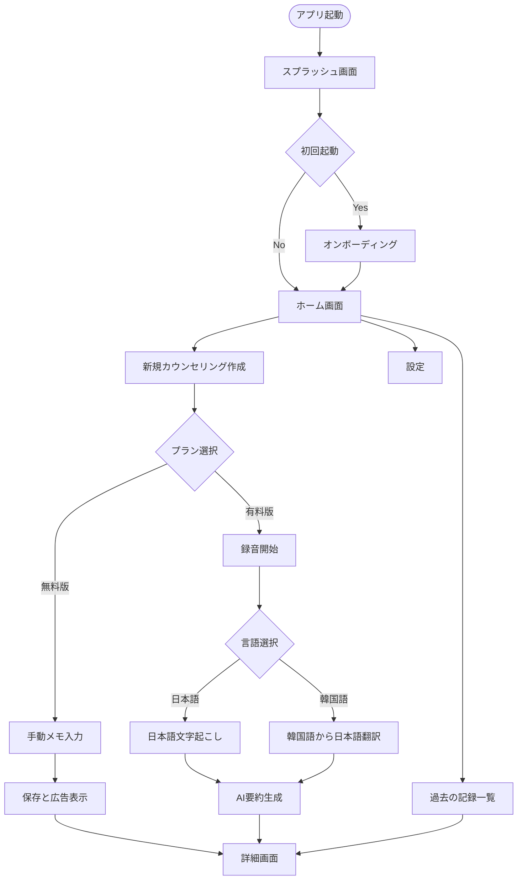

```mermaid
flowchart TD
    A([アプリ起動]) --> B[スプラッシュ画面]
    B --> C{初回起動}
    C -->|Yes| D[オンボーディング]
    C -->|No| E[ホーム画面]
    D --> E
    E --> F[新規カウンセリング作成]
    E --> G[過去の記録一覧]
    E --> H[設定]
    F --> J{プラン選択}
    J -->|無料版| K[手動メモ入力]
    K --> L[保存と広告表示]
    L --> M[詳細画面]
    J -->|有料版| N[録音開始]
    N --> O{言語選択}
    O -->|日本語| P[日本語文字起こし]
    O -->|韓国語| Q[韓国語から日本語翻訳]
    P --> R[AI要約生成]
    Q --> R
    R --> M
    G --> M
```
