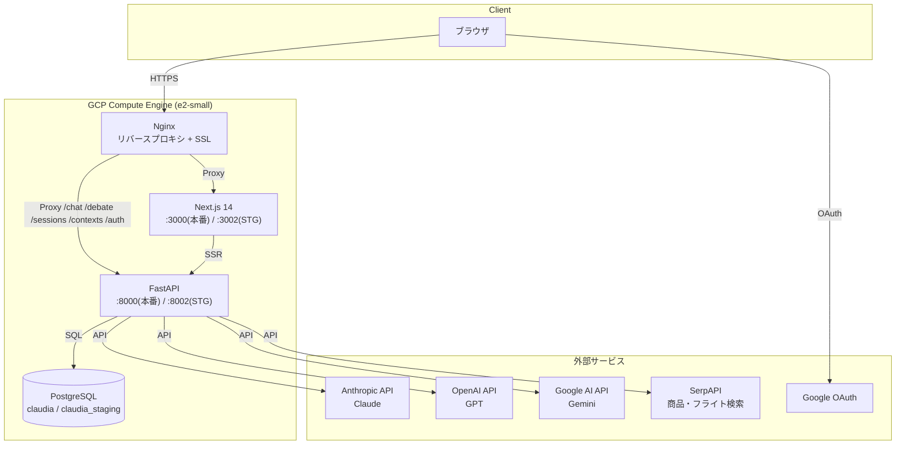
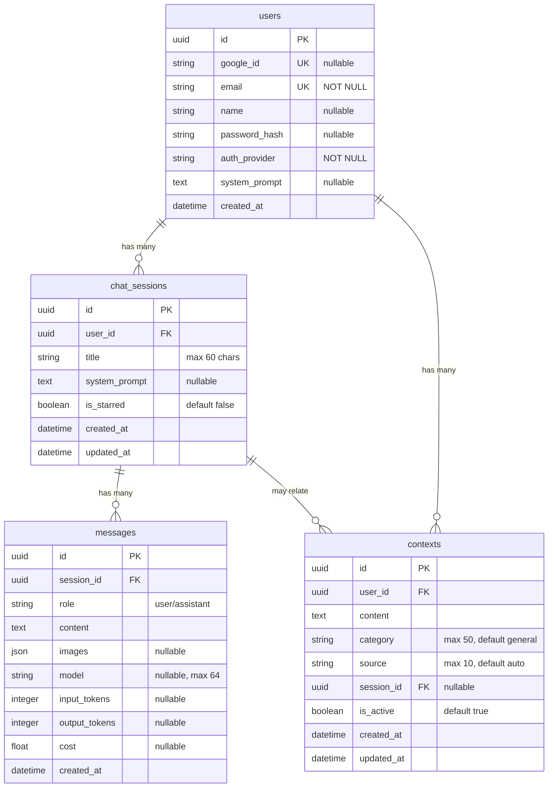
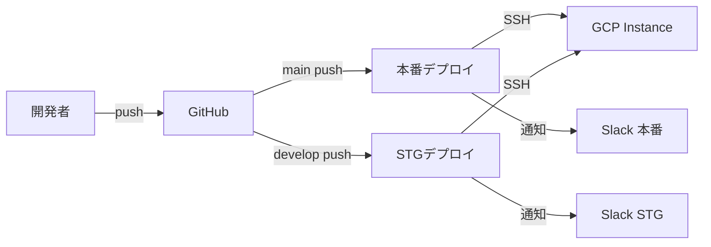

# Mazelan 基本設計書

最終更新: 2026-03-21

---

## 1. システム概要

### 1.1 プロジェクト概要

Mazelan は旅行特化型 AI チャット Web アプリケーション。ユーザーが自身の API キー（BYOK: Bring Your Own Key）を使って複数の AI プロバイダー（Claude / GPT / Gemini）と対話し、旅行計画の支援を受けられる。

### 1.2 主要機能

| 機能 | 概要 |
|------|------|
| マルチプロバイダー AI チャット | Claude / GPT / Gemini の9モデルに対応したストリーミングチャット |
| BYOK（Bring Your Own Key） | ユーザーが各プロバイダーの API キーを入力して利用 |
| 折りたたみ Q&A UI | 質問と回答をペアで表示し、過去のやり取りを折りたたみ可能 |
| ツール使用（Tool Use） | Amazon 商品検索・フライト検索を AI が自動実行 |
| Web 検索 | Claude の組み込み Web 検索、Gemini の Google Search Grounding |
| コンテキストメモリ | ユーザーの好みや情報を自動抽出・次回以降の会話に活用 |
| ディベートモード | 2つの AI モデルが議論し合う比較機能 |
| 画像添付 | チャットに画像を添付してマルチモーダル対話 |
| チャットエクスポート | Text / PDF 形式で会話を書き出し |
| 多言語対応（i18n） | 日本語・英語 |
| テーマ | Dark / Sky Blue / Cyan の3テーマ |
| Google Maps 店舗確認 | AI が推薦する店舗の営業状態をチェック |
| 会話分岐（Fork） | 任意の Q&A ペアから新しいセッションを作成 |
| PWA | スマホのホーム画面にインストール、オフラインでセッション操作 |
| パスワードリセット | メールによるパスワードリセット（Resend API） |
| アカウント削除 | ユーザーデータの完全削除 |
| スマホカメラ入力 | モバイルでカメラから直接画像を添付 |
| フォアグラウンド復帰 | バックグラウンド復帰時にメッセージ自動リロード |
| 運用通知 | 新規ユーザー登録・エラー・API使用量の Slack 通知 |

### 1.3 対象ユーザー

- 旅行計画を AI に相談したい個人ユーザー
- 自身の API キーを持つ AI 利用者

---

## 2. システム構成

### 2.1 全体構成図



### 2.2 技術スタック

| レイヤー | 技術 | バージョン |
|---------|------|-----------|
| フロントエンド | Next.js (App Router) | 14 |
| スタイリング | Tailwind CSS | 3.4 |
| 多言語 | next-intl | 4 |
| 認証 | NextAuth.js | v4 |
| バックエンド | FastAPI | 0.135.1 |
| ORM | SQLAlchemy | 2.0.48 |
| マイグレーション | Alembic | 1.18.4 |
| データベース | PostgreSQL | - |
| AI SDK | anthropic / openai / google-genai | 各最新 |
| Web サーバー | Nginx | - |
| デプロイ | GitHub Actions + systemd | - |
| PWA | @ducanh2912/next-pwa | 5.6 |
| メール送信 | Resend API | - |
| インフラ | GCP Compute Engine (e2-small) | 0.5vCPU / 2GB RAM |

### 2.3 環境構成

| 環境 | ブランチ | ドメイン | Backend Port | Frontend Port | DB |
|------|---------|----------|-------------|---------------|-----|
| 本番 | main | mazelan.ai | 8000 | 3000 | claudia |
| ステージング | develop | dev.mazelan.ai | 8002 | 3002 | claudia_staging |

---

## 3. 機能一覧

### 3.1 認証

| 機能 | 説明 |
|------|------|
| Google OAuth ログイン | Google アカウントでのシングルサインオン |
| メール/パスワード登録・ログイン | bcrypt によるパスワードハッシュ |
| セッション管理 | NextAuth.js の JWT Cookie 認証（maxAge=30日、updateAge=24時間） |
| パスワードリセット | HMAC-SHA256 トークンメール（Resend API、1時間有効） |
| アカウント削除 | 全ユーザーデータのカスケード削除 |

### 3.2 チャット

| 機能 | 説明 |
|------|------|
| ストリーミング応答 | Server-Sent Events でリアルタイム表示 |
| マルチモデル選択 | メッセージごとにモデルを切り替えて送信可能 |
| 画像添付 | 最大5枚、各10MB まで（JPEG/PNG/GIF/WebP） |
| コードハイライト | Markdown + シンタックスハイライト |
| トークン/コスト表示 | メッセージごとの使用量と費用を表示 |
| 拡張思考モード | Claude / Gemini の思考プロセスを表示 |
| 会話分岐 | 任意の Q&A ペアから新セッションを作成（fork） |
| スマホカメラ入力 | モバイルでカメラ撮影して添付 |
| フォアグラウンド復帰 | バックグラウンド復帰時に DB から再取得 |

### 3.3 セッション管理

| 機能 | 説明 |
|------|------|
| セッション一覧 | スター付き優先、更新日時順ソート |
| タイトル編集 | 最大60文字 |
| スター/解除 | お気に入りセッションの固定 |
| 削除 | メッセージ含むカスケード削除 |
| 検索 | セッションタイトルのフィルタリング |
| エクスポート | Text / PDF 形式 |

### 3.4 ツール使用（Tool Use）

| ツール | 説明 | データソース |
|--------|------|-------------|
| Amazon 商品検索 | 商品名で Amazon.co.jp を検索 | SerpAPI |
| フライト検索 | 出発地・目的地・日程でフライト検索 | SerpAPI (Google Flights) + Travelpayouts |
| Google Maps 店舗確認 | 推薦前に閉店チェック | SerpAPI (Google Maps) |
| Web 検索 | インターネット上の最新情報を検索 | Anthropic built-in / Google Search Grounding |

### 3.5 コンテキストメモリ

| 機能 | 説明 |
|------|------|
| 自動抽出 | 会話からユーザー情報を Claude Haiku で自動抽出 |
| カテゴリ分類 | preferences / skills / projects / personal / general |
| 手動管理 | ユーザーによる追加・編集・削除・有効/無効切替 |
| 重複防止 | 双方向部分文字列マッチングで重複を排除 |

### 3.6 ディベートモード

2つの AI モデルが5ステップで議論を展開:
1. モデル A の回答
2. モデル B の回答
3. モデル A の批評
4. モデル B の批評
5. 最終統合回答

### 3.7 カスタマイズ

| 機能 | 説明 |
|------|------|
| システムプロンプト | グローバル + セッション単位で設定可能 |
| テーマ切替 | Dark / Sky Blue / Cyan |
| 言語切替 | 日本語 / 英語 |

---

## 4. データベース設計

### 4.1 ER図



### 4.2 インデックス

| テーブル | カラム | 用途 |
|---------|--------|------|
| chat_sessions | user_id | ユーザー別セッション一覧 |
| messages | session_id | セッション別メッセージ取得 |
| messages | created_at | 時系列ソート |
| contexts | user_id | ユーザー別コンテキスト取得 |
| contexts | user_id + is_active | アクティブコンテキストの高速取得 |

---

## 5. API 設計

### 5.1 エンドポイント一覧

#### 認証 (`/auth`)

| メソッド | パス | 説明 | レートリミット |
|---------|------|------|---------------|
| POST | `/auth/upsert-user` | Google OAuth ユーザー作成/更新 | 10/min |
| POST | `/auth/register` | メール/パスワード登録 | 3/min |
| POST | `/auth/login` | メール/パスワードログイン | 3/min |
| POST | `/auth/forgot-password` | パスワードリセットメール送信 | 3/min |
| POST | `/auth/reset-password` | パスワードリセット実行 | 5/min |
| DELETE | `/auth/account` | アカウント削除 | 3/min |

#### チャット (`/chat`)

| メソッド | パス | 説明 | レートリミット |
|---------|------|------|---------------|
| POST | `/chat/{session_id}` | ストリーミングチャット | 20/min |

#### ディベート (`/debate`)

| メソッド | パス | 説明 | レートリミット |
|---------|------|------|---------------|
| POST | `/debate/{session_id}` | ディベートモード | 10/min |

#### セッション (`/sessions`)

| メソッド | パス | 説明 | レートリミット |
|---------|------|------|---------------|
| POST | `/sessions` | セッション作成 | 30/min |
| GET | `/sessions` | セッション一覧 | 30/min |
| GET | `/sessions/{id}/messages` | メッセージ取得 | 30/min |
| PUT | `/sessions/{id}` | タイトル変更 | 30/min |
| DELETE | `/sessions/{id}` | セッション削除 | 20/min |
| PUT | `/sessions/{id}/star` | スター切替 | 30/min |
| POST | `/sessions/{id}/fork` | セッション分岐 | 10/min |
| GET | `/sessions/user/system-prompt` | グローバルプロンプト取得 | 10/min |
| PUT | `/sessions/user/system-prompt` | グローバルプロンプト更新 | 10/min |
| GET | `/sessions/{id}/system-prompt` | セッションプロンプト取得 | 10/min |
| PUT | `/sessions/{id}/system-prompt` | セッションプロンプト更新 | 10/min |

#### コンテキスト (`/contexts`)

| メソッド | パス | 説明 | レートリミット |
|---------|------|------|---------------|
| GET | `/contexts` | コンテキスト一覧 | 20/min |
| POST | `/contexts` | コンテキスト作成 | 20/min |
| PATCH | `/contexts/{id}` | コンテキスト更新 | 20/min |
| DELETE | `/contexts/{id}` | コンテキスト削除 | 20/min |
| PATCH | `/contexts/{id}/toggle` | 有効/無効切替 | 20/min |

#### ヘルスチェック

| メソッド | パス | 説明 |
|---------|------|------|
| GET | `/health` | サーバー稼働確認 |

### 5.2 認証方式

- **ユーザー認証**: NextAuth.js JWT Cookie（`__Secure-next-auth.session-token`）
- **内部 API 認証**: `X-Internal-API-Key` ヘッダー（upsert-user 用）
- **AI API キー**: `X-API-Key` / `X-Anthropic-Key` / `X-Google-Fallback-Key` ヘッダー（BYOK）

### 5.3 ストリーミングレスポンス形式

```
Content-Type: text/plain (chunked)

テキストチャンク...
テキストチャンク...
<!--STATUS:🔍 フライト検索中...-->     ← ステータス表示
<!--STATUS:-->                          ← ステータスクリア
テキストチャンク...
<!--USAGE:{"input_tokens":500,"output_tokens":200,"cost":0.003}-->  ← 最終メタデータ
```

---

## 6. セキュリティ設計

### 6.1 認証・認可

| 対策 | 実装 |
|------|------|
| パスワードハッシュ | bcrypt（passlib）、8文字以上+大文字+数字必須 |
| API キー暗号化 | Web Crypto API (AES-GCM) で localStorage 暗号化 |
| セッション管理 | JWT Cookie（httpOnly, SameSite=Lax, Secure） |
| CSRF 対策 | SameSite Cookie |
| メール列挙防止 | パスワードリセット時に同一レスポンス |

### 6.2 入力制限

| 対策 | 実装 |
|------|------|
| レートリミット | slowapi（IP 単位、エンドポイント別） |
| 画像サイズ制限 | 10MB/枚、5枚/リクエスト |
| タイトル長制限 | 60文字 |
| ストリーミングタイムアウト | 5分 |
| 長 URL 防御 | 500文字超を [リンク省略] に置換 |
| メッセージ長制限 | 50,000文字 |
| システムプロンプト長制限 | 2,000文字 |
| コンテキスト長制限 | 1,000文字 |
| CORS 制限 | 必要な methods/headers のみ許可 |

### 6.3 HTTP ヘッダー

| ヘッダー | 値 |
|---------|-----|
| X-Frame-Options | DENY |
| X-Content-Type-Options | nosniff |
| Referrer-Policy | strict-origin-when-cross-origin |
| HSTS | max-age=31536000; includeSubDomains |
| CSP | default-src 'self'; script-src 'self' 'unsafe-inline'; ... |
| Expect-CT | max-age=86400, enforce |
| Permissions-Policy | camera=(self), microphone=(), geolocation=() |

---

## 7. インフラ・デプロイ設計

### 7.1 デプロイフロー



### 7.2 デプロイ手順（自動）

1. GitHub Actions が Workload Identity Federation で GCP 認証
2. SSH でデプロイスクリプトを実行
3. `git fetch` + `git reset` で最新コード取得
4. `venv/bin/pip install` で Python 依存更新
5. `alembic upgrade head` でマイグレーション実行
6. サービス停止（メモリ確保）
7. `npm ci` + `npm run build`（NODE_OPTIONS: max 384MB）
8. サービス起動
9. ヘルスチェック（60秒リトライ）
10. Slack 通知

### 7.3 ブランチ戦略

```
main（本番） ← develop（統合） ← feature/*（機能開発）
```

- feature/* → develop: `--no-ff` マージ必須
- develop → main: ユーザーの明示的指示が必要
- ドキュメントのみの変更は develop に直接コミット可

### 7.4 サービス構成

| サービス | 管理 | 説明 |
|---------|------|------|
| claudia-backend | systemd | FastAPI (uvicorn) |
| claudia-frontend | systemd | Next.js |
| postgresql | systemd | データベース |
| nginx | systemd | リバースプロキシ + SSL |

---

## 8. 対応モデル一覧

| プロバイダー | モデル | 入力単価 ($/M) | 出力単価 ($/M) | 画像 | Web検索 | ツール |
|-------------|--------|---------------|---------------|------|---------|--------|
| Anthropic | Claude Haiku 4.5 | 0.80 | 4.00 | ✓ | ✓ | ✓ |
| Anthropic | Claude Sonnet 4.6 | 3.00 | 15.00 | ✓ | ✓ | ✓ |
| Anthropic | Claude Opus 4.6 | 15.00 | 75.00 | ✓ | ✓ | ✓ |
| OpenAI | GPT-4o mini | 0.15 | 0.60 | ✓ | ✗ | ✓ |
| OpenAI | o3-mini | 1.10 | 4.40 | ✗ | ✗ | ✓ |
| OpenAI | GPT-4o | 2.50 | 10.00 | ✓ | ✗ | ✓ |
| Google | Gemini 2.5 Flash Lite | 0.075 | 0.30 | ✓ | ✓ | ✓ |
| Google | Gemini 2.5 Flash | 0.15 | 0.60 | ✓ | ✓ | ✓ |
| Google | Gemini 2.5 Pro | 1.25 | 10.00 | ✓ | ✓ | ✓ |
