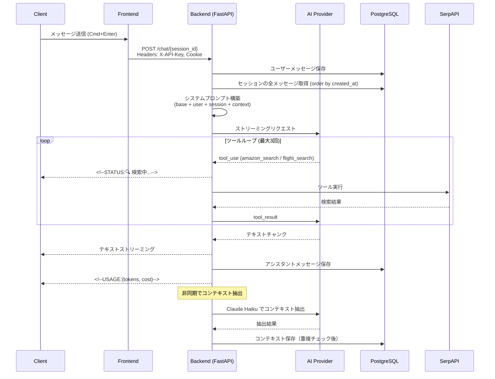
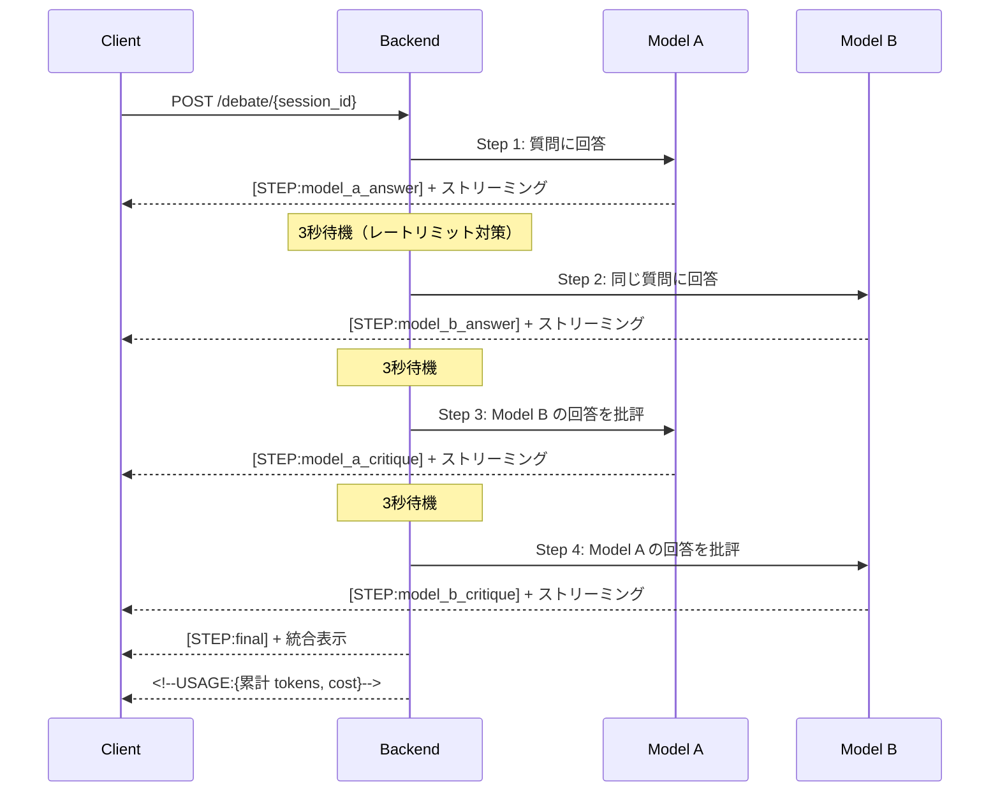
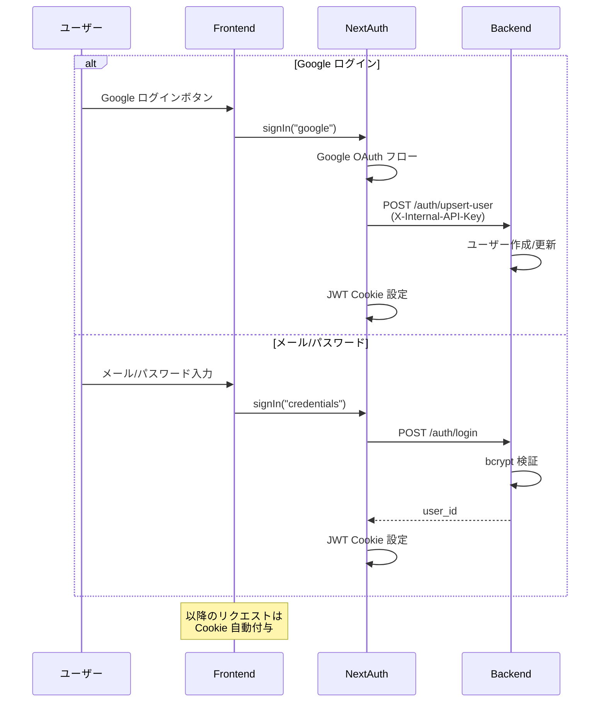

# Mazelan 詳細設計書

最終更新: 2026-05-24

---

## 1. バックエンド詳細設計

### 1.1 ファイル構成

```
backend/
├── main.py              # FastAPI アプリ初期化、ミドルウェア、例外ハンドラ
├── database.py          # SQLAlchemy エンジン、セッション管理
├── models.py            # ORM モデル（User, ChatSession, Message, Context）
├── schemas.py           # Pydantic バリデーション（画像・音声）
├── dependencies.py      # JWT 認証依存（NextAuth JWT）
├── providers.py         # マルチプロバイダー LLM 抽象化
├── base_prompt.py       # システムプロンプトテンプレート
├── context_extractor.py # コンテキスト自動抽出（Claude Haiku）
├── amazon_search.py     # Amazon 商品検索（SerpAPI）
├── flight_search.py     # フライト検索（SerpAPI + Travelpayouts）
├── maps_search.py      # Google Maps 店舗確認（SerpAPI）
├── slack_notify.py     # Slack 運用通知（新規ユーザー・エラー）
├── email_sender.py     # メール送信（Resend API）
├── serpapi_cache.py     # SerpAPI インメモリ TTL キャッシュ
├── serpapi_monitor.py   # SerpAPI 使用量モニタリング（日次レポート・閾値アラート）
├── seed_user.py         # ユーザー作成 CLI ユーティリティ
└── routers/
    ├── auth.py          # 認証エンドポイント
    ├── chat.py          # チャットストリーミング
    ├── debate.py        # ディベートモード
    ├── sessions.py      # セッション CRUD
    └── contexts.py      # コンテキストメモリ CRUD
```

### 1.2 マルチプロバイダーアーキテクチャ（providers.py）

#### 1.2.1 MODEL_REGISTRY

全モデルを統一的に管理する辞書。各エントリは以下のフィールドを持つ:

```python
{
    "model_id": {
        "provider": "anthropic" | "openai" | "google",
        "label": "表示名",
        "input_price": float,   # $/M tokens
        "output_price": float,  # $/M tokens
        "supports_images": bool,
        "supports_thinking": bool,
    }
}
```

#### 1.2.2 プロバイダー別ストリーミング関数

| プロバイダー | 関数 | 特記事項 |
|-------------|------|---------|
| Anthropic | `stream_anthropic()` | web_search 組み込み対応、thinking ブロック対応 |
| OpenAI | `stream_openai()` | o-series は `max_completion_tokens` 使用、画像は data URI 形式 |
| Google | `stream_google()` | `google_search` と `function_calling` を同時渡し。併用不可エラー時は google_search のみにフォールバック |

#### 1.2.3 メッセージフォーマット変換

**Anthropic → OpenAI 変換:**
- `image` ブロック → `image_url` (data URI) に変換
- `system` メッセージ → メッセージ配列の先頭に移動
- o3-mini は画像非対応のため自動除去

**Anthropic → Gemini 変換:**
- `Content` / `Part` 型に変換
- 連続する同一 role メッセージを自動マージ（Gemini の制約）
- `inline_data` 形式で画像を渡す

#### 1.2.4 ツール実行ループ

```
ユーザーメッセージ送信
  ↓
AI がツール呼び出しを返す（tool_use）
  ↓
ツール実行（amazon_search / flight_search / google_maps_search）
  ↓
結果を AI に返す（tool_result）
  ↓
AI が最終回答を生成（最大3ラウンド）
```

- Anthropic: `tool_use` / `tool_result` コンテンツブロック
- OpenAI: `function_calling` / `tool_calls` 形式
- Gemini: `FunctionDeclaration` / `FunctionResponse` 形式
- ディベートモードでは Web 検索のみ有効（`web_search_only=True`）
  - カスタムツール（amazon/flight/maps）は無効、Web 検索は有効

#### 1.2.5 Gemini フリーキープール

```
ユーザーキーあり → ユーザーキーで実行
  ↓（未設定）
Flash Lite かつ GEMINI_FREE_KEYS 設定あり → プールからローテーション
  ↓（クォータエラー）
X-Google-Fallback-Key ヘッダーあり → フォールバックキーで実行
  ↓（未設定）
エラー返却
```

#### 1.2.6 拡張思考（Extended Thinking）

| プロバイダー | 設定 | トークン予算 |
|-------------|------|-------------|
| Anthropic | `thinking={"type": "enabled", "budget_tokens": 10000}` | 10,000 |
| OpenAI (o-series) | `max_completion_tokens` 自動使用 | - |
| Gemini | `ThinkingConfig(thinking_budget=10000)` | 10,000 |

### 1.3 チャットストリーミング処理フロー（chat.py）



### 1.4 ディベートモード処理フロー（debate.py）



### 1.5 コンテキスト抽出フロー（context_extractor.py）

```
チャット応答完了
  ↓ (非同期・fire-and-forget)
ユーザーメッセージを2000文字に切り詰め
  ↓
Claude Haiku に抽出依頼（ユーザーの言語で）
  ↓
JSON 配列で返却: [{content, category}]
  ↓
各エントリに対して:
  - 既存コンテキストと双方向部分文字列比較
  - 重複なし → DB に保存
  - 重複あり → スキップ
```

### 1.6 フライト検索アルゴリズム（flight_search.py）

```
入力: origin, destination, departure_month, day_from, day_to, trip_weeks
  ↓
Step 1: day_from == day_to なら ±1日、それ以外は day_from〜day_to の全日を候補に
  ↓
Step 2: 各候補日で片道検索（並列） → 最安2日程を選定
  ↓
Step 3: 帰国日検索（return_month 指定時はそちらを使用、なければ trip_weeks±1日）
         → 最安の帰国日を特定
  ↓
Step 4: 上位2組の日程で往復詳細検索（並列）
  ↓
Step 5: スコアリング（price×1.0 + duration×50 + stops×10000）
         → 上位結果 + 最安フライトを返却
```

**SerpAPI 消費量**: 最大 ~11回/検索（キャッシュヒット時は0回）
**キャッシュ TTL**: フライト 3時間、Amazon 1時間、Maps 2週間

### 1.7 システムプロンプト階層

```
1. base_prompt（旅行コンシェルジュ基本指示 + ツールガイダンス）
   ↓ 結合
2. ユーザーグローバルプロンプト（users.system_prompt）
   ↓ 上書き/追加
3. セッション固有プロンプト（chat_sessions.system_prompt）
   ↓ 追加
4. コンテキストメモリブロック（<context_memory>タグ）
```

### 1.8 翻訳モード処理フロー（base_prompt.py + chat.py + providers.py）

翻訳モードは通常チャットを完全に置き換える特殊モード。

#### リクエストフィールド（ChatRequest）

| フィールド | 型 | デフォルト | 説明 |
|----------|-----|---------|------|
| `translation_mode` | bool | `false` | 翻訳モードON/OFF |
| `translation_fast_mode` | bool | `false` | true=高速（翻訳1行のみ） / false=詳細（翻訳+解説） |
| `audio` | `AudioAttachment` | `null` | 音声入力（翻訳モード時のみ、Gemini限定） |

#### プロンプト切替

```python
if req.translation_mode:
    # 通常の base_prompt / user_prompt / context_block を全部スキップ
    system_prompt = build_system_prompt(
        translation_mode=True,
        translation_fast_mode=req.translation_fast_mode,
    )
    # ツールも全部無効化
    disable_tools = True
else:
    system_prompt = build_system_prompt(user_prompt, context_block, ...)
    disable_tools = False
```

#### プロンプト内容

| モード | 大きさ | 含む内容 |
|--------|--------|---------|
| 高速モード | 約50トークン | 言語判定指示 + 話者前提固定 + カジュアル指示 + 「1行のみ返答」 |
| 詳細モード | 約130トークン | 上記 + 出力フォーマット定義（翻訳→別表現→ポイント） + 解説言語=入力言語ルール |

両モードとも共通の話者前提:
- 日本語側 = 年上男性（自分=anh、相手=em）
- ベトナム語側 = 年下女性（自分=em、相手=anh）

#### 音声入力（マルチモーダル翻訳）

```
[マイク録音 (MediaRecorder)] → [base64エンコード] → [POST /chat/{id}]
                                       ↓
[ChatRequest.audio] → [Gemini Part.from_bytes(audio/webm)]
                                       ↓
[Gemini が音声を直接処理して翻訳出力（中間文字起こしなし）]
```

非Geminiプロバイダーで音声送信時は HTTP 400 を返す。

#### Nginx 設定の重要点

マイクを使うためには `Permissions-Policy` ヘッダで microphone を許可する必要がある:

```nginx
add_header Permissions-Policy "camera=(), microphone=(self), geolocation=()" always;
```

`microphone=()` の場合、ブラウザは `getUserMedia` を完全ブロックし、許可ダイアログすら出ない。

### 1.9 エラーハンドリング

#### プロバイダー例外クラス

| 例外 | 表示 | 原因 |
|------|------|------|
| `ProviderAuthError` | 🔑 API キーエラー | 無効/未設定のキー |
| `ProviderRateLimitError` | ⏱️ レートリミット | 429 レスポンス |
| `ProviderSpendLimitError` | 💳 月間上限超過 | 課金上限到達 |
| `ProviderError` | ⚠️ 汎用エラー | その他のエラー |

#### Gemini リトライ戦略

- 対象: 429、503、UNAVAILABLE、RESOURCE_EXHAUSTED
- 方式: 指数バックオフ（2^attempt 秒）
- 最大リトライ: 3回

### 1.10 レートリミット設定

| エンドポイント | 制限 |
|---------------|------|
| `/auth/register` | 3/min |
| `/auth/login` | 3/min |
| `/auth/forgot-password` | 3/min |
| `/auth/reset-password` | 5/min |
| `/auth/account` (DELETE) | 3/min |
| `/auth/upsert-user` | 10/min |
| `/chat/*` | 20/min |
| `/debate/*` | 10/min |
| `/sessions` (CRUD) | 30/min |
| `/sessions/*/delete` | 20/min |
| `/sessions/*/system-prompt` | 10/min |
| `/sessions/*/fork` | 10/min |
| `/contexts/*` | 20/min |

---

## 2. フロントエンド詳細設計

### 2.1 ファイル構成

```
frontend/
├── app/
│   ├── layout.tsx           # ルートレイアウト（i18n + Providers）
│   ├── providers.tsx        # SessionProvider + ThemeProvider
│   ├── page.tsx             # / → /chat リダイレクト
│   ├── chat/page.tsx        # メインチャットページ（状態管理の中心）
│   ├── login/page.tsx       # ログインページ
│   ├── reset-password/page.tsx # パスワードリセット
│   ├── terms/page.tsx       # 利用規約
│   ├── privacy/page.tsx     # プライバシーポリシー
│   └── api/auth/[...nextauth]/route.ts  # NextAuth ハンドラ
├── components/
│   ├── Sidebar.tsx          # セッション一覧、設定、テーマ切替
│   ├── ChatInput.tsx        # メッセージ入力、画像添付、モデル選択
│   ├── QAPairBlock.tsx      # 折りたたみ Q&A ペア表示
│   ├── MessageContent.tsx   # Markdown レンダリング
│   ├── ApiKeyModal.tsx      # API キー管理モーダル
│   ├── SystemPromptModal.tsx # システムプロンプト設定
│   ├── ContextModal.tsx     # コンテキストメモリ管理
│   ├── DebateDisplay.tsx    # ディベート表示
│   ├── ProviderIcon.tsx     # プロバイダーアイコン SVG
│   └── TokenUsageTooltip.tsx # トークン使用量ツールチップ
├── lib/
│   ├── api.ts               # バックエンド API クライアント
│   ├── types.ts             # TypeScript 型定義
│   ├── apiKeyStore.ts       # localStorage API キー管理
│   ├── themeContext.tsx      # テーマ Context
│   ├── exportChat.ts        # チャットエクスポート
│   └── offlineQueue.ts     # オフライン操作キュー（PWA）
├── i18n/
│   └── request.ts           # next-intl サーバー設定
├── messages/
│   ├── en.json              # 英語翻訳
│   └── ja.json              # 日本語翻訳
├── middleware.ts             # 認証ミドルウェア（/chat 保護）
└── types/
    └── next-auth.d.ts       # NextAuth 型拡張
```

### 2.2 状態管理設計

Redux/Zustand は未使用。React hooks + Context API で管理。

#### ChatPage（chat/page.tsx）の主要 State

| State | 型 | 用途 |
|-------|-----|------|
| `sessions` | `Session[]` | セッション一覧 |
| `activeSessionId` | `string \| null` | 選択中のセッション |
| `messages` | `Message[]` | 現在のセッションのメッセージ |
| `isStreaming` | `boolean` | ストリーミング中フラグ |
| `selectedModel` | `ModelId` | 選択中のモデル |
| `isDebateMode` | `boolean` | ディベートモード ON/OFF |
| `isThinkingMode` | `boolean` | 拡張思考モード ON/OFF |

#### localStorage キャッシュ

| キー | 内容 | 用途 |
|------|------|------|
| `mazelan_sessions` | セッション一覧 | 初回ロード高速化 |
| `mazelan_active_session` | アクティブセッション ID | セッション復元 |
| `mazelan_session_models` | モデル ID | セッション別モデル選択保持 |
| `mazelan_model` / `mazelan_model2` | デフォルトモデル | モデル選択永続化 |
| `mazelan_{provider}_api_key` | API キー（AES-GCM 暗号化） | BYOK キー保持 |
| `mazelan_offline_queue` | オフライン操作キュー | PWA でのスター/削除/リネーム |
| `mazelan_user_id` | ユーザー ID | ユーザー切替検知・キャッシュクリア |

#### Context API

| Context | 提供値 | 用途 |
|---------|--------|------|
| `SessionProvider` (NextAuth) | `useSession()` | 認証状態 |
| `ThemeProvider` | `{ theme, toggleTheme, themeLabel }` | テーマ管理 |
| `NextIntlClientProvider` | 翻訳関数 | i18n |

### 2.3 コンポーネント詳細

#### ChatInput

```
送信方法: Enter = 送信（PC）、Shift/Ctrl+Enter = 改行（PC）
          Enter = 改行 + 送信ボタン（モバイル）

機能:
- テキスト入力（textarea、自動リサイズ）
- 画像添付（クリップボード貼り付け or ファイル選択）
- スマホカメラ入力（モバイルのみ、capture="environment"）
- モデル選択ドロップダウン
- ディベートモード切替
- 拡張思考モード切替
- 画像プレビュー表示
```

#### QAPairBlock

```
構造:
├── ユーザーメッセージ（質問）
│   ├── テキスト
│   └── 添付画像（サムネイル）
├── アシスタントメッセージ（回答）
│   ├── MessageContent（Markdown レンダリング）
│   ├── DebateDisplay（ディベート時）
│   ├── TokenUsageTooltip（トークン/コスト）
│   └── ForkButton（分岐ボタン、Git 分岐風アイコン）
└── 折りたたみ/展開ボタン

動作:
- 最新の Q&A ペア以外は自動折りたたみ
- クリックで展開/折りたたみ切替
```

#### Sidebar

```
構造:
├── 新規チャットボタン
├── 検索バー
├── セッション一覧
│   ├── スター付きセッション（優先表示）
│   └── 通常セッション（更新日時順）
│       ├── タイトル（クリックで選択、ダブルクリックで編集）
│       ├── スターボタン
│       ├── エクスポートボタン
│       └── 削除ボタン
├── 設定エリア
│   ├── API キー設定
│   ├── システムプロンプト設定
│   └── コンテキストメモリ設定
├── テーマ切替ボタン
├── 言語切替ボタン
└── ユーザー情報
    ├── ログアウト
    └── アカウント削除
```

### 2.4 API クライアント（lib/api.ts）

#### ストリーミング通信

```typescript
async function* streamChat(sessionId, message, model, images?, ...): AsyncGenerator<string>
```

- `fetch` + `ReadableStream` で SSE を受信
- `TextDecoder` でチャンクをデコード
- `<!--STATUS:...-->` はステータス表示に分離
- `<!--USAGE:...-->` はトークン情報として分離
- API キーは `X-API-Key` 等のカスタムヘッダーで送信
- Cookie は `credentials: "include"` で自動付与

### 2.5 テーマシステム

#### CSS 変数ベース

```
テーマクラス:
- (なし)      → Dark テーマ
- light-blue  → Sky Blue テーマ
- light-cyan  → Cyan テーマ

html 要素にクラスを付与して切替
```

#### Tailwind カスタムカラー

| 用途 | Tailwind クラス |
|------|----------------|
| 背景（ベース） | `bg-theme-base` |
| 背景（サーフェス） | `bg-theme-surface` |
| 背景（入力欄） | `bg-theme-input` |
| ホバー | `bg-theme-hover` |
| テキスト（主要） | `text-t-primary` |
| テキスト（副次） | `text-t-secondary` |
| ボーダー | `border-border-primary` |

### 2.6 i18n 設計

- **ライブラリ**: next-intl v4
- **ロケール検出**: Cookie → Accept-Language → デフォルト(en)
- **翻訳ファイル**: `messages/en.json`, `messages/ja.json`, `messages/vi.json`
- **使用方法**: `useTranslations('namespace')` フック
- **対応言語**: 英語 / 日本語 / ベトナム語（ブラウザ言語に応じて自動切替、`locale` cookie で上書き可）
- **言語切替UI**: 現状なし（ブラウザ依存）

ベトナム語 UI は翻訳機能とは別概念。翻訳機能は AI が翻訳する機能であり、i18n UI は画面表示そのものをユーザー言語に合わせる機能。

### 2.7 認証フロー



---

## 3. データベース詳細設計

### 3.1 テーブル定義

#### users テーブル

| カラム | 型 | NULL | デフォルト | 制約 | 説明 |
|--------|-----|------|-----------|------|------|
| id | UUID | NO | uuid4() | PK | ユーザー ID |
| google_id | VARCHAR | YES | - | UNIQUE | Google OAuth ID |
| email | VARCHAR | NO | - | UNIQUE | メールアドレス |
| name | VARCHAR | YES | - | - | 表示名 |
| password_hash | VARCHAR | YES | - | - | bcrypt ハッシュ |
| auth_provider | VARCHAR | NO | - | - | 'google' / 'email' |
| system_prompt | TEXT | YES | - | - | グローバルプロンプト |
| created_at | TIMESTAMP | NO | utcnow() | - | 作成日時 |

#### chat_sessions テーブル

| カラム | 型 | NULL | デフォルト | 制約 | 説明 |
|--------|-----|------|-----------|------|------|
| id | UUID | NO | uuid4() | PK | セッション ID |
| user_id | UUID | NO | - | FK→users.id | 所有者 |
| title | VARCHAR(60) | NO | - | - | タイトル |
| system_prompt | TEXT | YES | - | - | セッション固有プロンプト |
| is_starred | BOOLEAN | NO | False | - | スター状態 |
| created_at | TIMESTAMP | NO | utcnow() | - | 作成日時 |
| updated_at | TIMESTAMP | YES | utcnow() | ON UPDATE | 更新日時 |

#### messages テーブル

| カラム | 型 | NULL | デフォルト | 制約 | 説明 |
|--------|-----|------|-----------|------|------|
| id | UUID | NO | uuid4() | PK | メッセージ ID |
| session_id | UUID | NO | - | FK→chat_sessions.id | セッション |
| role | VARCHAR | NO | - | - | 'user' / 'assistant' |
| content | TEXT | NO | - | - | メッセージ本文 |
| images | JSON | YES | - | - | 画像配列 [{media_type, data}] |
| model | VARCHAR(64) | YES | - | - | 使用モデル名 |
| input_tokens | INTEGER | YES | - | - | 入力トークン数 |
| output_tokens | INTEGER | YES | - | - | 出力トークン数 |
| cost | FLOAT | YES | - | - | コスト (USD) |
| created_at | TIMESTAMP | NO | utcnow() | INDEX | 作成日時 |

#### contexts テーブル

| カラム | 型 | NULL | デフォルト | 制約 | 説明 |
|--------|-----|------|-----------|------|------|
| id | UUID | NO | uuid4() | PK | コンテキスト ID |
| user_id | UUID | NO | - | FK→users.id, INDEX | 所有者 |
| content | TEXT | NO | - | - | 記憶内容 |
| category | VARCHAR(50) | NO | 'general' | - | カテゴリ |
| source | VARCHAR(10) | NO | 'auto' | - | 'auto' / 'manual' |
| session_id | UUID | YES | - | FK→chat_sessions.id | 関連セッション |
| is_active | BOOLEAN | NO | True | - | 有効/無効 |
| created_at | TIMESTAMP | NO | utcnow() | - | 作成日時 |
| updated_at | TIMESTAMP | YES | utcnow() | ON UPDATE | 更新日時 |

### 3.2 マイグレーション履歴

| 順序 | リビジョン | 内容 |
|------|-----------|------|
| 1 | d8e53b4207ae | 初期テーブル作成（users, chat_sessions, messages） |
| 2 | a1b2c3d4e5f6 | messages に images カラム追加 |
| 3 | b2c3d4e5f6a7 | users, chat_sessions に system_prompt 追加 |
| 4 | c3d4e5f6a7b8 | contexts テーブル作成 |
| 5 | d405cc65ddce | chat_sessions に updated_at 追加 |
| 6 | e5f6a7b8c9d0 | messages に model 追加 |
| 7 | f1a2b3c4d5e6 | chat_sessions に is_starred 追加 |
| 8 | g7h8i9j0k1l2 | messages に input_tokens, output_tokens, cost 追加 |
| 9 | h8i9j0k1l2m3 | パフォーマンスインデックス追加 |

---

## 4. インフラ詳細設計

### 4.1 Nginx ルーティング

| パス | 転送先 | 設定 |
|------|--------|------|
| `/chat/{UUID}` | Backend :8000 | SSE、proxy_buffering off、timeout 600s |
| `/debate/{UUID}` | Backend :8000 | SSE、proxy_buffering off、timeout 600s |
| `/contexts` | Backend :8000 | 通常プロキシ |
| `/sessions` | Backend :8000 | 通常プロキシ |
| `/auth/` | Backend :8000 | 通常プロキシ |
| `/health` | Backend :8000 | ヘルスチェック |
| `/` (その他) | Frontend :3000 | WebSocket 対応（Upgrade ヘッダー） |

**注意**: SSE エンドポイントは UUID 正規表現でマッチし、フロントエンドの `/chat` ページとの衝突を回避。

### 4.2 systemd サービス構成

```
claudia-backend.service
  ├── After: network.target, postgresql.service
  ├── ExecStart: venv/bin/uvicorn backend.main:app --host 127.0.0.1 --port 8000
  ├── EnvironmentFile: .env
  └── Restart: always (5秒間隔)

claudia-frontend.service
  ├── After: network.target, claudia-backend.service
  ├── ExecStart: next start -p 3000
  ├── EnvironmentFile: frontend/.env.local
  └── Restart: always (5秒間隔)
```

### 4.3 GitHub Actions ワークフロー

#### 本番デプロイ（deploy.yml）

```
トリガー: push to main
認証: Workload Identity Federation
同時実行制御: deploy-gce グループ（全プロジェクト共有）

Steps:
1. GCP 認証
2. SSH で deploy-prod.sh 実行
3. ヘルスチェック（:8000/health）
4. Slack 通知（Mazelan 本番チャンネル）
```

#### ステージングデプロイ（deploy-staging.yml）

```
トリガー: push to develop
追加処理: DEV バージョン抽出、変更概要抽出

Steps:
1. コードチェックアウト（fetch-depth: 50）
2. DEV バージョン番号抽出
3. マージコミットから変更概要抽出
4. GCP 認証
5. SSH で deploy-staging.sh 実行
6. ヘルスチェック（:8002/health）
7. Slack 通知（バージョン + 変更内容付き）
```

### 4.4 デプロイスクリプト処理

```
1. git fetch + reset（最新コード取得）
2. venv/bin/pip install -r requirements.txt
3. venv/bin/alembic upgrade head
4. systemctl stop backend + frontend（メモリ確保）
5. npm ci（失敗時 npm install にフォールバック）
6. NODE_OPTIONS="--max_old_space_size=384" npm run build
7. systemctl start backend + frontend
8. 60秒ヘルスチェックループ（2秒間隔）
```

### 4.5 PostgreSQL チューニング

e2-small (0.5vCPU / 2GB RAM) 向けの軽量設定:

| パラメータ | 値 | 理由 |
|-----------|-----|------|
| shared_buffers | 64MB | RAM の約3% |
| work_mem | 4MB | クエリ単位のメモリ |
| maintenance_work_mem | 32MB | VACUUM 等 |
| max_connections | 20 | 小規模 VM 向け |
| effective_cache_size | 256MB | OS キャッシュ見積もり |

### 4.6 SSL / TLS

- Let's Encrypt (certbot) で自動取得・更新
- Nginx 設定は certbot が自動追記（デプロイスクリプトでは上書きしない）
- HSTS 有効（max-age=31536000）

---

## 5. 外部サービス連携

### 5.1 SerpAPI

| 項目 | 値 |
|------|-----|
| 用途 | Amazon 商品検索、Google Flights 検索、Google Maps 店舗確認 |
| 無料枠 | 250回/月 |
| キャッシュ | インメモリ TTL（Amazon: 1時間、フライト: 3時間、Maps: 2週間） |
| 使用量モニタリング | 日次サマリー（JST 1:00）+ 閾値アラート（残50/20/10回）→ Slack |
| フォールバック | エラー時は Web 検索で代替（注意書き付き） |
| 環境変数 | `SERPAPI_KEY` |

### 5.2 Travelpayouts

| 項目 | 値 |
|------|-----|
| 用途 | 航空会社公式サイト URL 生成、Aviasales 価格比較リンク |
| アフィリエイト ID | 508503 |
| 環境変数 | `TRAVELPAYOUTS_TOKEN` |

### 5.3 Google OAuth

| 項目 | 値 |
|------|-----|
| 用途 | Google アカウントでのログイン |
| 環境変数 | `GOOGLE_CLIENT_ID`, `GOOGLE_CLIENT_SECRET` |

### 5.4 Slack

| 項目 | 値 |
|------|-----|
| 用途 | デプロイ通知 + 新規ユーザー登録通知 + サーバーエラー通知 + SerpAPI 日次レポート |
| チャンネル | デプロイ通知 / 運用通知 |
| 環境変数 | `SLACK_OPS_WEBHOOK_URL`（運用通知用） |

### 5.5 Resend

| 項目 | 値 |
|------|-----|
| 用途 | パスワードリセットメール送信 |
| 無料枠 | 100通/日 |
| 送信元 | noreply@mazelan.ai |
| DNS | SPF/DKIM/DMARC（Cloudflare で設定済み） |
| 環境変数 | `RESEND_API_KEY` |

---

## 6. 環境変数一覧

### 6.1 バックエンド (.env)

| 変数 | 必須 | 説明 |
|------|------|------|
| `DATABASE_URL` | ✓ | PostgreSQL 接続文字列 |
| `SERPAPI_KEY` | - | SerpAPI キー（ツール使用に必要） |
| `TRAVELPAYOUTS_TOKEN` | - | Travelpayouts トークン |
| `RESEND_API_KEY` | - | Resend API キー（パスワードリセット） |
| `SLACK_OPS_WEBHOOK_URL` | - | Slack 運用通知 Webhook URL |
| `FRONTEND_URL` | - | フロントエンド URL（リセットメールのリンク用） |

### 6.2 バックエンド (.env.production)

| 変数 | 必須 | 説明 |
|------|------|------|
| `DATABASE_URL` | ✓ | 本番 DB 接続文字列 |
| `NEXTAUTH_SECRET` | ✓ | NextAuth セッション暗号化キー |
| `CORS_ORIGINS` | ✓ | 許可オリジン |
| `INTERNAL_API_KEY` | ✓ | 内部 API 認証キー |
| `ENV` | ✓ | "production" |

### 6.3 フロントエンド (frontend/.env.production)

| 変数 | 必須 | 説明 |
|------|------|------|
| `NEXTAUTH_URL` | ✓ | アプリケーション URL |
| `NEXTAUTH_SECRET` | ✓ | NextAuth 暗号化キー |
| `BACKEND_URL` | ✓ | バックエンド内部 URL |
| `NEXT_PUBLIC_BACKEND_URL` | ✓ | バックエンド公開 URL（ビルド時埋め込み） |
| `GOOGLE_CLIENT_ID` | ✓ | Google OAuth クライアント ID |
| `GOOGLE_CLIENT_SECRET` | ✓ | Google OAuth シークレット |
| `INTERNAL_API_KEY` | ✓ | 内部 API 認証キー |
